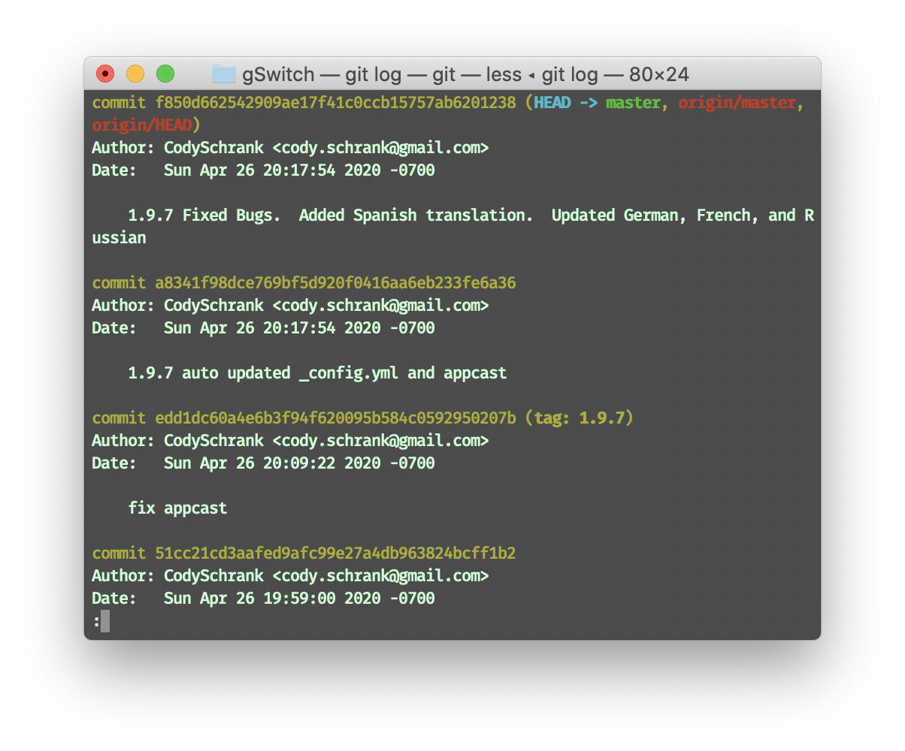

# GIT Commands
Lets learn some basic git commands
# Let git know who you are
Use `git config` to configurate values on a global or local project level. <br>
Run the following to tell git who you are.
```bash
git config --global user.name "{name}" # Set name that is attached to commits.
git config --global user.email "{email}" # Set email for commits.
```
## Details (Optional)
`git config` can use the following few flags:
- [x] `--local` (by default). `git config` writes to a local level. Local level configuration only applies to the current context repository, the configuration values are stored in a file that can be found in the repo's .git directory: `".git/config"`
- [x] `--global` On a global configuration level for the current user. Can be found at `"~ /.gitconfig"`.
- [x] `--system` Apply across machine among all users/projects.

# Create your Repo
There are two common commands:
```bash 
git init # Turn existing directory into git repository.
git clone {url} # Download a existing repository, including all of the files, branches, and commits
```

# Save Changes
`git add` adds the changed file/dir to the staging area.
- [x] `git add <file>` Add a file.
- [x] `git add <dir>` Add a directory.
- [x] `git add . ` Add all files. `.` is equal to `-A` or `--all` flag.
  
**Note**: Make sure `git add` after changes are made before `git commit`.

Lets overlook the different stages in Git. ***(Figure credit to developer Jonathan Irvin)*** <br>
 <br>
`git commit` Commits the staged snapshot of the current project and may launch a text editor asking for a message. 
- [x] `git commit -a`: Flag `-a` Includes all currently changed files (previously `git add`) in this commit. *BUT* **untracked (new) files are not included.** 
- [x] `git commit -m "{commit message}"` quickly commit with a `{commit messsage}`.
- [x] `git commit -amend` : Rewrites the very last commit.

`git stash` temporarily shelves (or stashes) changes that has been made (without commiting). People can then come back and re-apply them later on. 
> Stashing is handy if anyone needs to quickly switch context and work on something else, but mid-way through a code change and aren't quite ready to commit.

check [This Link](https://linuxtechlab.com/beginners-guide-on-how-to-git-stash-a-git-tutorial/) for details on `git stash`.

# Commit History　
run `git log` will list all commit history in a interactive terminal, which looks similar to below <br>
 <br>
The following infomation can be obtained
- [ ] A unique hash `commit` number that identifies the commit.
- [ ] The `author` who commit as well as `email`.
- [ ] The `Date` for the commit.
- [ ] A note and info about the commit

You can also do `git log --oneline` to keep it concise and packed.
## Revert to a previous commit
Run `git log --oneline`. It shows the complete commit history for your branch, starting with the most recent. `branching points` are also shown (the history of everything that got merged).
### Git Reset (Use with CAUTION)
`git reset` command allows you to RESET your current head to a specified state. You can reset the state of specific files as well as an entire branch. This is useful if you haven't pushed your commit up to GitHub or another remote repository yet.


