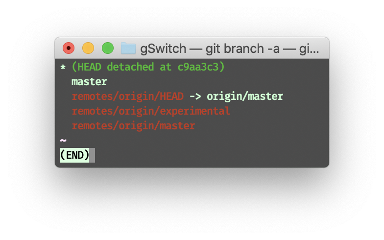

# Git Remotes
Git remote repositories show the following:

- Remotes can serve as a backup. All information is stored locally over `local git repositories`. It has the ability to restore files to a previous state by having copies of the git repository elsewhere.
- Remotes make coding collaborative.

## Git Remote Branches
After `git clone`, there is likely a new branch in the local repository called `origin/master` under `remote`.  
  
`origin/master` is in the format `<remote name>/<branch name>`.  
Remote branches reflect the *state* of the `remote repository`, therefore `origin/master` updates and ***ONLY*** updates as the remote updates. Any commits upon `origin/master` results to a commit with detached `HEAD`. 

## `git fetch`
`git fetch` fetches data from a *remote* repository.
> `git fetch` brings the **local representation** of the remote repository into *synchronization* with the **actual remote repository**.

***Note：*** `git fetch` does **NOT** change anything about the local state, nor change **anything** about the current files.

## `git pull`
`git pull` is a workflow of fetching remote changes and then merging them.
it's like `git merge origin/master`.
> `git pull` is just shorthand for a fetch and a merge. `git pull --rebase` is shorthand for a fetch and a rebase!

## `git push`
`git push <remote> <branch>` to push a Git branch to remote.