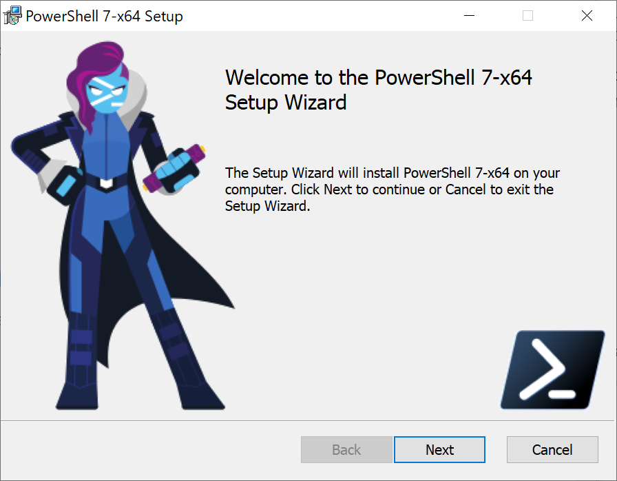
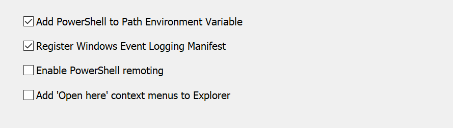
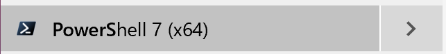

# Getting Ready
**Git** is a **free and open source distributed version control system** 
- [x] Tiny Footprint 
- [x] Good Performance

# Install GIT
## PC user
- [x] Download at https://git-scm.com
- [x] Use windows PowerShell 
### What is a PowerShell?
`PowerShell` is a cross-platform **task automation and configuration management framework**, consisting of a `command-line shell` and `scripting language`. <br>
### Install PowerShell
Search `PowerShell 7.0` or go to  [its Github releases](https://github.com/PowerShell/PowerShell/releases). Locate the most suitable version under <span style="color:green; font-weight:bold">Latest release</span> tag. likely the <span style="color:steelblue; font-weight:bold">arm64</span> version. <br>
Follow the instuctions. <br>
 <br>
Make sure check the following:
 <br>
You can run PowerShell:
 <br>
**NOTE:** `$env:ProgramFiles\PowerShell\7` as `PATH` after installation
### Install Git
Download the proper version from [This Link](https://git-scm.com)
and install.
You can uncheck the following to make the Windows Explorer menu cleaner.


### Install VSCode
make sure a checkbox looks like `add code to $PATH` is checked during installation.

### Run Git in PowerShell
Check out the Github [page](https://github.com/JanDeDobbeleer/oh-my-posh) <br>
Run PoswerShell as `Admin` and run:
```PowerShell 
Set-ExecutionPolicy Bypass -Scope Process -Force; [System.Net.ServicePointManager]::SecurityProtocol = [System.Net.ServicePointManager]::SecurityProtocol -bor 3072; iex ((New-Object System.Net.WebClient).DownloadString('https://chocolatey.org/install.ps1'))
```
After this
```PowerShell
Install-Module posh-git -Scope CurrentUser
Install-Module oh-my-posh -Scope CurrentUser
```
That installs `posh-git` to use `git` command, and `oh-my-posh` for proper theming. Then run:
```PowerShell
code $Profile
```
To open PowerShell profile in VsCode, and append
```PowerShell
Import-Module posh-git
Import-Module oh-my-posh
Set-Theme Agnoster
```
`Agnoster` is just one of the theme, you can find more at the Github page that was mentioned.<br>
### Use NerdFonts
[Nerd Fonts](https://www.nerdfonts.com) are iconic fonts for developers, download your favorite font and use it in PowerShell....<br>
And [Check This](https://github.com/joonro/Get-ChildItemColor) to have your `ls` command has colorful returns.<br>
In the end, with some other tweakings, your PowerShell could look like


## Mac User
### Getting Ready

### Configure your Oh My Zsh
[Oh My Zsh](https://ohmyz.sh) is an open source, community-driven framework for managing your Z-Shell (default since `MacOS Catalina`) configuration.
```Bash
sh -c "$(curl -fsSL https://raw.github.com/ohmyzsh/ohmyzsh/master/tools/install.sh)"
```
Done


